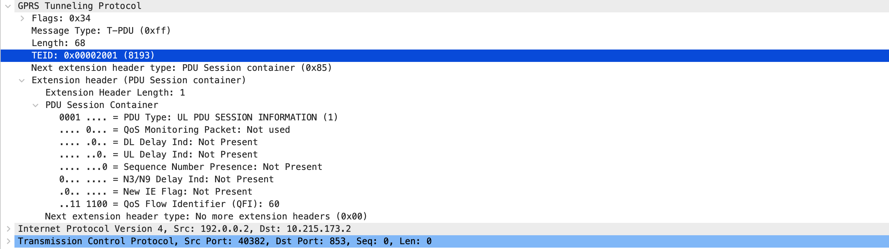

# 5g-traffic-generator
A traffic generation toolkit for sending GTP-U packets with configurable TEID and QFI values. Useful for 5G core and transport testing, including slicing experiments.

Employs `AF_PACKET` for direct interaction with the network interface, enabling efficient packet transmission. Tools like `gtpu_cbr_generator.c` allows for scaling performance across multiple CPU cores, and can reach 1Mpps+ on a multi-core system.

## Dependencies
Make sure `libpcap` development headers are installed:

```bash
sudo apt-get install libpcap-dev
```

## Quick Start
```
sudo apt-get install libpcap-dev libjansson-dev
mkdir build
cd build
cmake ..
make
```

## Run
You can use the helper scripts in the scripts/ directory. For example:
```bash
./scripts/gtpu_sender_test.sh
```
This script sends GTP-U packets to the destination IP/port specified.
It should produce output similar to:
```
Sent GTP-U packet 1 with TEID=0x100 and QFI=5
Sent GTP-U packet 2 with TEID=0x101 and QFI=6
Sent GTP-U packet 3 with TEID=0x102 and QFI=7
Sent GTP-U packet 4 with TEID=0x103 and QFI=8
```

## Tools
- `gtpu_sender_test`: Minimal GTP-U sender for basic functional tests.
- `gtpu_cbr_generator`: Sends constant bit rate GTP-U traffic with multiple TEIDs and QFIs.
- `pcap_analyzer`: Parses and analyzes PCAP traces to extract traffic statistics.
- `gtpu_encapsulator`: Wraps PCAP files in GTP-U + outer IP/UDP/Ethernet headers.
- `gtpu_replay`: Replays GTP-U packets from a pcap file created by `gtpu_encapsulator`.
- `gtpu_traffic_generator`: Profile-driven sender (variable sizes/rates, app-like patterns).

## GTP-U Header Format




GTPU header created using `gtpu_encapsulator`. See `sample_pcaps`. You can inspect these using Wireshark.

## Customization
To change source/destination IP or MAC addresses, open the relevant `.c` source file (e.g., `src/gtpu_cbr_generator.c`) and modify the variables. Then recompile the code.
